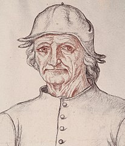

Bosch Bot
=========

Bosch Bot is a Discord bot, written mostly for fun to pass the time at home.
It is named after famous Dutch painter *Hieronymus Bosch*
whose famous painting *The Garden of Earthly Delights*
together with a friend's funny idea resulted in this bot.

All of this is work in progress,
thus might change and/or break at any point in time
without any prior notice.
